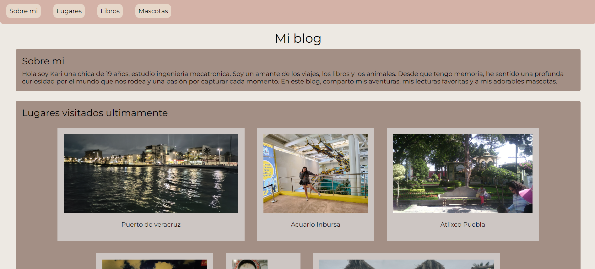

# Proyecto Pagina web de gustos personales

Este proyecto es un tipo de blog personal, creada como parte del bootcamp de desarrollo frontend de Technolochicas PRO. 

El desarrollo se realizó utilizando exclusivamente HTML y CSS puro, con el objetivo de practicar y fortalecer el dominio de estas tecnologías.

[Proyecto Desplegado (https://my-blog-six-wheat.vercel.app/)](https://my-blog-six-wheat.vercel.app/)

## Tecnologia
* HTML
* CSS

## Vista previa de la pagina

---
Desarrollado con 🤍 por [Karina Escalante](https://www.instagram.com/kary_olmos_22?igsh=aHI4c2hubzB3NXEx) en [TECHNOLOCHICAS PRO](https://tecnolochicas.mx/)